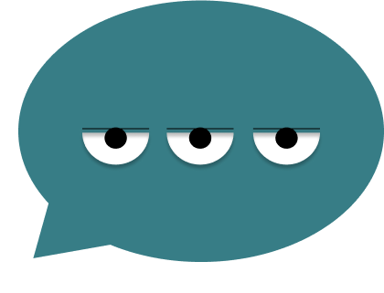

    

# Chatão

Repositório de desenvolvimento do Chatão, um chat. Ele conta com várias funcionalidades:

- Cadastro e login
- Personalização de perfil
- Troca de mensagens com outros usuários em tempo real
- Filtro de usuários

## Organização do repositório

O repositório é dividido em dois diretórios principais:

1. chatao-back-end: Onde se encontra o back-end da aplicação
2. chatao-front-end: Onde se encontra o front-end da aplicação

## Como rodar o Chatao?

Para rodar a aplicação é preciso rodar tanto o front-end quanto o back-end. Para isso, vá aos dois diretórios e siga as instruções presentes nos READMEs dos mesmos.